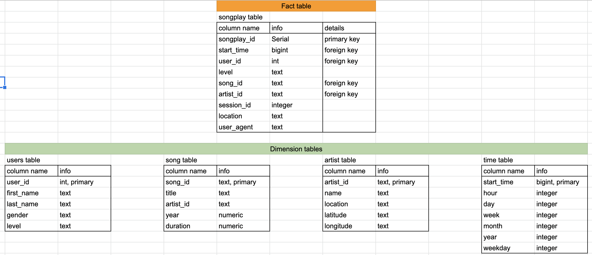

# Problem
 Sparkify has so much data collected on songs and user activity on their music app and wants to perform analysis on their users and the songs they are playing. Currently, their data is stored in json format in two set of files, `song_data` and `log_data`. They current architecture does not allow them to do the analysis effectively.
 
# Solution: Bring Sparkify data on Data Lake

Sparkify needs a database with the star schema and ETL pipeline. Since the analysis need to be optimized to query song play data, star schema should have songplay table as a fact table and other key identities (users, songs, artists, time) as dimension tables.  
 
Visual demonstrion of the final tables can be found below:

 
In this project, we build the ETL pipeline hosted on s3. ETL script loads the json files from s3 using the `schema-on-read` feature of spark. It then transform them to create `users`, `songs`, `artists`, `time`, and `songplay` dataframe. Later, it upload the data frames into S3 in Parquet format to preserve schema of tables.

The solution has been initially designed on a sample data being avaialble on a local machine for the sake of speeding up the debugging and testing process.

# Run

## etl.py

Use this script to read the files from s3, and then write back the tables to s3.

`python etl.py`. 

## dwh.cfg
add your aws credintials here, including AWS_ACCESS_KEY_ID, and AWS_SECRET_ACCESS_KEY

# Sample Queries
in `etl.py`, find the function `test_parquet` for testing the extracted parquet files that has been written to s3.
As a result of running this function, you can see how many records have been inserted in to these tables.

Another example displays the songplay data for users in washington:
 `select * from songplays where location like '%Washington%'`
 

 

